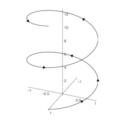

# CAD-Exchanger-testing

```bash
clang-format -i */*.cpp */*.h
```

```bash
make
./build/main
```

**Design a small program in C++ that would implement support of 3D curves hierarchy.**

1. Support a few types of 3D geometric curves – circles, ellipses and 3D helixes. (Simplified definitions are below). Each curve should be able to return a 3D point and a first derivative (3D vector) per parameter **t** along the curve.
2. Populate a container (e.g. vector or list) of objects of these types created in random manner with random parameters.
3. Print coordinates of points and derivatives of all curves in the container at t=PI/4.
4. Populate a second container that would contain only circles from the first container. Make sure the second container shares (i.e. not clones) circles of the first one, e.g. via pointers.
5. Sort the second container in the ascending order of circles’ radii. That is, the first element has the smallest radius, the last - the greatest.
6. Compute the total sum of radii of all curves in the second container.

(*) Additional optional requirements:

7. Split implementation into a library of curves (.dll or .so) and executable which uses API of this library.
8. Implement computation of the total sum of radii using parallel computations (e.g. OpenMP or Intel TBB library).

Requirements to the implementation:

1. The implementation must use virtual methods.
2. Has neither explicit memory deallocation nor memory leaks.
3. Curves must be physically correct (e.g. radii must be positive).
4. Containers and sorting must be implemented using STL (C++ Standard Template Library).
5. The implementation may use constructs of C++11 or higher.
6. The code must compile with any compiler of your choice (gcc, Visual C++, etc).

Curve definitions:

- **All curves are parametrically defined, i.e. a point is calculated using some C(t) formula.**
- **Circle is planar in the plane XoY (i.e. all Z-coordinates are 0) and is defined by its radius.**
- **Ellipse is planar in the plane XoY and is defined by its two radii, along X and Y axes.**
- **Helix is spatial and is defined by its radius and step (see the figure below). It takes 2 * PI in parametric space to make a round, i.e. any point on helix satisfies the condition C(t + 2*PI) = C(t) + {0, 0, step}**.



---

**Разработать небольшую программу на C++, которая реализует поддержку иерархии 3D кривых.**

1. Поддержка нескольких типов 3D геометрических кривых — окружности, эллипсы и 3D спирали (упрощенные определения приведены ниже). Каждая кривая должна уметь возвращать 3D точку и первую производную (3D вектор) по параметру **T** вдоль кривой.
2. Заполнить контейнер (например, вектор или список) объектами этих типов, созданными случайным образом с случайными параметрами.
3. Напечатать координаты точек и производные всех кривых в контейнере при t=PI/4.
4. Заполнить второй контейнер, который будет содержать только окружности из первого контейнера. Убедитесь, что второй контейнер использует общие элементы (то есть не клонирует), например, через указатели.
5. Отсортировать второй контейнер в порядке возрастания радиусов окружностей. То есть первый элемент имеет наименьший радиус, последний — наибольший.
6. Вычислить общую сумму радиусов всех кривых во втором контейнере.

(*) Дополнительные необязательные требования:

7. Разделить реализацию на библиотеку кривых (.dll или .so) и исполнимый файл, который использует API этой библиотеки.
8. Реализовать вычисление общей суммы радиусов с использованием параллельных вычислений (например, с использованием OpenMP или Intel TBB).

Требования к реализации:

1. Реализация должна использовать виртуальные методы.
2. Не должно быть явного освобождения памяти или утечек памяти.
3. Кривые должны быть физически корректными (например, радиусы должны быть положительными).
4. Контейнеры и сортировка должны быть реализованы с использованием STL (Стандартная библиотека шаблонов C++).
5. Реализация может использовать конструкции C++11 или выше.
6. Код должен компилироваться с любым компилятором на ваш выбор (gcc, Visual C++ и т.д.).

Определения кривых:

* **Все кривые параметрически определены, т.е. точка вычисляется с помощью некоторой формулы C(t).**
* **Окружность является планарной в плоскости XoY (то есть все Z-координаты равны 0) и определяется своим радиусом.**
* **Эллипс является планарным в плоскости XoY и определяется двумя радиусами вдоль осей X и Y.**
* **Спираль является пространственной и определяется своим радиусом и шагом (см. рисунок ниже). Для того, чтобы пройти полный оборот, требуется 2 * PI в параметрическом пространстве, т.е. любая точка на спирали удовлетворяет условию C(t + 2*PI) = C(t) + {0, 0, шаг}.**


